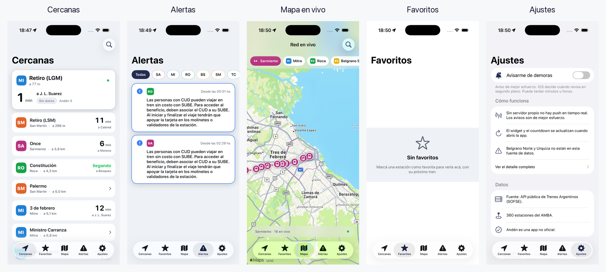

<div align="center">
  
  <h1>Andén</h1>
  <p><b>Tu tren, en vivo.</b> Arribos en tiempo real de los trenes del AMBA (Buenos Aires).</p>
  <p>App nativa · iOS (SwiftUI) + Android (Kotlin/Compose)</p>
</div>

---

> ## ⚠️ Prototipo — leé esto antes de usarlo
>
> Andén es un **prototipo experimental**, sin mantenimiento y sin garantía de ningún tipo.
>
> - **No tiene soporte ni mantenimiento.** Puede dejar de funcionar en cualquier momento (las fuentes de datos son de terceros y cambian sin aviso).
> - **El autor no se hace responsable** de nada relacionado con su uso: datos incorrectos, demoras, decisiones de viaje, ni cualquier daño directo o indirecto. Usalo **bajo tu propia responsabilidad**.
> - **No es oficial.** No está afiliada a Trenes Argentinos (SOFSE), al Gobierno de la Ciudad de Buenos Aires, a SUBE ni a ningún operador. Usa APIs públicas de terceros.
> - **No está en ninguna tienda de apps.** La única forma de obtenerla es descargando el APK (Android) de las Releases de este repo, o compilando el código.
>
> Se distribuye "tal cual" (AS IS), sin garantías, bajo licencia MIT.

Andén responde la única pregunta del pasajero: **cuántos minutos falta tu tren en tu estación**. Demora real, andén, GPS del tren en vivo y alertas de la línea, en un toque.



## Descargar (Android)

La única forma de obtener Andén es bajando el **APK** de las Releases de este repo. No está en Google Play ni en ninguna tienda.

➡️ **[Descargá `Anden-android.apk` acá](https://github.com/alandaitch/anden/releases/latest)**

1. Abrí `Anden-android.apk` en tu teléfono.
2. Si te pide, permití **instalar apps de esta fuente** (Ajustes → apps desconocidas).
3. Instalá y listo.

App nativa (Kotlin + Jetpack Compose + osmdroid). Código en [`android/`](android/).

### iOS

No hay APK equivalente para iOS: hay que **compilarla vos** con Xcode (ver [Compilar](#compilar)).

## Funciones

- **Multimodal** — pestaña "Cerca" con selector **Tren · Subte · Bici**:
  - **Subte en vivo**: líneas A–H con sus colores oficiales, arribos por estación con demora real y estado de servicio.
  - **EcoBici en vivo**: estaciones más cercanas con bicis mecánicas/eléctricas y anclajes libres.
  - _Subte y Bici usan la API de Transporte de la Ciudad_ (ver [Configurar la API de la Ciudad](#configurar-la-api-de-la-ciudad-subte--ecobici)).
- **Cercanas**: ordena las estaciones por tu ubicación y muestra el próximo tren de cada una.
- **Tablero de estación**: countdown grande, andén, demora con color (en horario / leve / fuerte / sin dato), destino y ramal.
- **Favoritos con contexto**: marcá una estación; prioriza "casa" a la mañana y "trabajo" a la tarde.
- **Detalle + mapa en vivo**: recorrido completo y el tren moviéndose por GPS en MapKit.
- **Mapa de red**: todos los trenes de una línea en vivo.
- **Alertas**: por línea y por ramal, ordenadas por criticidad, deduplicadas.
- **Widget + Live Activity + Dynamic Island**: próximo tren en la pantalla de inicio y bloqueada.
- **Notificaciones de demora** (mejor esfuerzo, sin servidor propio).

## Fuente de datos

Andén usa la API pública de **Trenes Argentinos (SOFSE)**: `https://api-servicios.sofse.gob.ar/v1`.

- Arribos en vivo sin token: `GET /arribos/estacion/{id}`.
- Catálogo de **360 estaciones con coordenadas** embebido (`Anden/Resources/estaciones.json`).
- Alertas e infraestructura con un token que se genera con el algoritmo del cliente oficial.

La documentación completa de la API, verificada, está en [`docs/api-reference.md`](docs/api-reference.md).

> **No oficial.** Andén no está afiliada a SOFSE ni a Trenes Argentinos. Belgrano Norte y Urquiza no están en esta API (las operan Ferrovías y Metrovías).

## Arquitectura

SwiftUI + Observation, iOS 17+. Dos targets que comparten `Shared/`:

```
Anden/     app (App, Features, Components, Onboarding, Resources)
Shared/    modelos, cliente API, catálogo, lógica, store, tema, Live Activity  (app + widget)
Widget/    widget de home/lock + Live Activity (Dynamic Island)
docs/      referencia de la API, plan, research
```

## Compilar

Requisitos: macOS con Xcode 17+ y [XcodeGen](https://github.com/yonaskolb/XcodeGen).

```bash
brew install xcodegen
git clone https://github.com/alandaitch/anden.git
cd anden
xcodegen generate
open Anden.xcodeproj
```

En Xcode, elegí tu equipo de firma en **Signing & Capabilities** (cambiá `DEVELOPMENT_TEAM` en `project.yml` por el tuyo) y corré en el simulador o en tu iPhone.

> Con una cuenta de Apple gratuita (Personal Team) la app se instala en tu propio iPhone, pero el perfil dura 7 días y hay que reinstalar. Las notificaciones push en tiempo real no son posibles sin un servidor propio; ver [`docs/ios-tech.md`](docs/ios-tech.md).

## Configurar la API de la Ciudad (Subte + EcoBici)

El **tren** anda sin configurar nada. Para **Subte** y **EcoBici** hace falta una key gratis de la API de Transporte de la Ciudad de Buenos Aires:

1. Sacá tu `client_id` y `client_secret` en [api-transporte.buenosaires.gob.ar](https://api-transporte.buenosaires.gob.ar).
2. Copiá `Anden/Resources/Secrets.example.plist` a `Anden/Resources/Secrets.plist`.
3. Pegá tus credenciales ahí. `Secrets.plist` está en `.gitignore`: **nunca se commitea**.

Sin la key, la app funciona igual pero Subte y Bici muestran "configurá la API".

## Créditos

Hecho por **Alan Daitch** + **Claude** (Anthropic).

Algoritmo de autenticación de la API documentado por la comunidad en [ariedro/api-trenes](https://github.com/ariedro/api-trenes). Datos de Trenes Argentinos (SOFSE).

## Licencia

MIT — ver [LICENSE](LICENSE).
